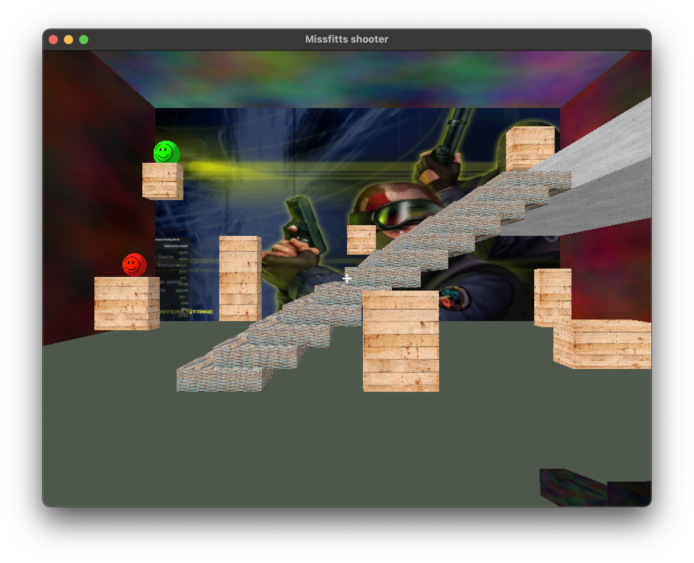

<p align="center">
  
</p>


# cHRI Group 11 | MissFitt's Shooter

Welcome to the control in Human Robot interaction repo of Group 11. Here you will find the solution for PA3. Happy reading!

## Running the examples

First, create and activate a python virtual environment by running:

```
python -m venv .venv
<<<<<<< HEAD
./.venv/bin/activate
=======
.venv\Scripts\activate

./.venv/bin/activate 
>>>>>>> 6b93118 (Adding graphics, merging target respawn spots)
```

> .venv is automatically gitignored in this project. If you want to store the environment in a different folder, you have to add it to the gitignore

Next, install the requirements needed to run this project:

```
pip install -r requirements.txt
```

This will automatically install all modules needed to run the simulation.
These can then be run by:

```
python main.py
```
